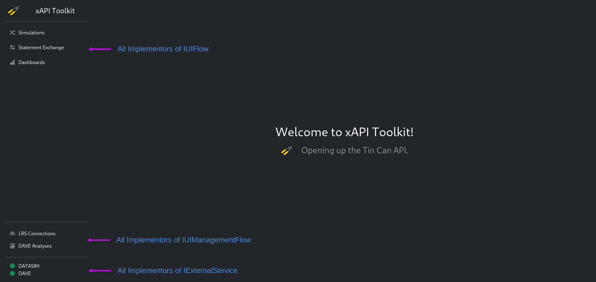

# Developer's Guide

| Project Title          | Version |    Date    | Author                          |
|:-----------------------|:-------:|:----------:|:--------------------------------|
| xAPI Toolkit - DATASIM |   v1    | 27.01.2022 | Konstantin Köhring (@Galaxy102) |

## Intro

Hello there, thank you for your interest in maintaining or extending the xAPI Toolkit, 
which has been begun as a Bachelor Thesis project for the research group "VerDatAs"
at the Technical University of Dresden.

To make your work as comfortable as possible, the POM should be able to cover all CI steps.
Just load it into your IDE (I have used IntelliJ for development), set the Application Profile to `dev` 
and think of great values for the variables in [application-dev.properties](src/main/resources/application-dev.properties).

For my setup, I have chosen the following parameters:

| Environment Variable           | Value                 |
|:-------------------------------|:----------------------|
| XAPITOOLS_SEC_USERNAME         | foo                   |
| XAPITOOLS_SEC_PASSWORD         | bar                   |
| XAPITOOLS_SIM_BACKEND_BASE_URL | http://localhost:9090 |
| XAPITOOLS_SIM_BACKEND_USERNAME | foo                   |
| XAPITOOLS_SIM_BACKEND_PASSWORD | bar                   |
| XAPITOOLS_SIM_STORAGE_DIR      | /tmp/xapitools        |

Their semantic is explained in the README.

Apart from running and debugging your application from the IDE, you can build a Docker Image for it by running `./mvnw (or your OS equivalent) spring-boot:build-image`.
Usually from your CI, by providing `-Ddocker.publish=true` you can also push the container image to the registry specified in the POM.

The external service dependencies can be started with `docker-compose up -d (datasim|whatever)`, see the [Compose file](docker-compose.yml) for details.

## Application Overview

The Application consists roughly of a UI Controller (`ui.BasepageMavController`), a Security Handler (`security` Package) and Sub-Applications.

Sub-Applications shall reside in their own packages. 
The UI distinguishes Sub-Applications to either be a "Flow" (a real, standalone application) or a "Setting" (perhaps Connection Settings).
I'd like future programmers to adhere to a separation of concerns: 
Any "Flow" may access any "Setting", but "Settings" may not use any "Flows" and "Flows" shall use each other as little as possible.
An Example in this context would be: 
I have some LRS connection (a "Setting"). 
It may be used by any "Flow" that needs to communicate with an LRS through a Connector (which is part of the Setting), but must not be mutated in any way outside the Setting.

Furthermore, the UI is bound automagically:  

To learn about this in detail, you are advised to study the Javadoc (`./mvnw javadoc:javadoc`) and Spring Dependency Injection.

## Step-by-Step Guides

### Maintaining the Application

So you have found a Bug or want to do some routine maintenance.
You can probably navigate to the required code by searching the Logs for details (mind the exception markers aka "Tracing Codes").

1. Isolate the erroneous Class  
   Find exactly the point in the Application where something goes wrong by examining logs and Data Flows (you would begin with the Controllers, then Services and Connectors and finally the Entities).
   By using semantic package and class names, you should be just fine to navigate as you think.
2. Fix whatever needs fixing  
   Be as precise as possible when changing the Source Code and **comment your changes**, especially what did go wrong and -if you know- why.
   Try to find a way to inhibit invalid control paths (e.g. by adding Validators).
3. Give credits to yourself and your sources  
   If you found the solution to your problem online, write a comment with your source. Feel free to add yourself to the Author section of the Class's Javadoc.
4. Bump the version  
   I'd consider it good practice increasing the Version Number of the Project (in the POM).

### Extending the Application

The application was designed with Extensibility in mind.

You can create your new sub-application independently of existing code with the only coupling points being the UI templates (optionally).

1. Write your Application as you would normally do.  
   Make sure to seed Entities only in `dev`-Profile.  
   Separate your Settings from your Main Program!  
   To simplify the integration later, please also consider the following separation in your Controllers:
   * Separate RestControllers from UI Controllers
   * The Main UI ("Entrypoint") of your Application shall reside in one Standalone Controller.
   * (only non-Settings) All Sub-UIs (Forms, Detail Pages) shall have their very own Controller.  
   Please also try to extract any external Logic (Application or Library Integrations) to standalone Connectors.  
   If you want to use Bootstrap and jQuery for your UI, you are all set by replacing your HTML's `title` tag with
   `<head th:include="bootstrap/header.html :: scripted_head ('<YOUR PAGE TITLE HERE>')"></head>`
2. Make your Controllers implement the UI Magic-Binding Interfaces  
   * The Main UI Controller of your Application should implement `IUIFlow`; your Settings Controller should implement `IUIManagementFlow` instead.  
     Icons can be added to `ui.BootstrapUIIcon` or any other enum implementing `IUIIcon` as you need. Be sure to include the necessary sources when using a new Icon supplier.
   * All Subpage-Controllers of the Main UI should implement a Subinterface of `IUIStep`. Please abstract the base interface for your own dynamic binding to work.
     Perhaps examine `datasim.controllers` for a good example.
   * Any Connectors to Out-Of-Scope Services that will run alongside the Toolkit should implement `IExternalService` for a Health Check to be displayed.
3. Bump the Version Number  
   For breaking changes or major new features, draft a new major Project Version in the POM.

## Painful bugs encountered earlier

* The default HTML input `datetime-local` stepping is 60 seconds. Reduce it to 1 where needed.
* Hibernate does not handle UUIDs properly as ID in MariaDB. Use the `@Column(columnDefinition = "BINARY(16)")` annotation to fix this!

## Deeper Dive: Design Patterns in use

* Model-View-Controller  
  This Pattern is sourced directly from Spring. It dictates the following:
  * Your UI is filled by Controllers
  * which source or perform actions on a Model of Entities by using Services (a Backend)
  * and is finally rendered to a View (here: by a Templating Engine)  
  The MVC Pattern is great to implement a separation of concerns.
* Transfer Objects  
  Using Transfer Objects in the Application yields a lot of Flexibility when communicating with external Services.
  By using your mind (and Jackson Annotations), you can generate a JSON-Representation from your Entity without hassle.  
  Plus point: By using TOs with the MVC pattern, you have guaranteed decoupling from your persistence layer, which also improves the applications overall security.  
  To implement Mapping between Transfer Objects and Entities, all Transfer Objects have Factories (for themselves and their corresponding Entities).
* Component-Driven  
  All Parts of this possibly big application can be used stand-alone (apart from the Main UI).
* Adapters  
  All external dependencies are wrapped in Connectors which handle the communication with the external service or library.
* Inversion of Control/Dependency Injection  
  This Pattern also originates in Spring.
  By annotating our Objects (i.e. Controllers, Services and other Components) correctly, Spring will automatically bind them when we need them.
* Java Bean Lifecycle Management  
  This is not a Pattern per se, but an import design aspect for handling the possibility to have multiple external services using one kind of connector.
  The connector is templated depending on an Entity, and the Lifecycle manager (here: lrs.connector.LrsConnectorLifecycleManager) is responsible 
  for creating, destroying and delivering the instance of the connector when needed.
