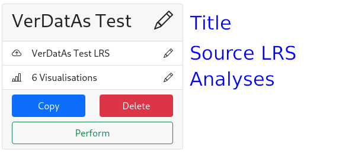
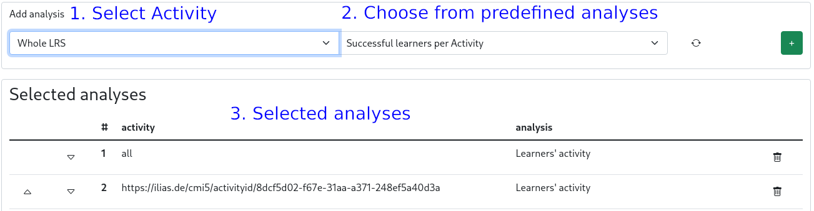

# User's Guide

| Project Title          | Version |    Date    | Author                          |
|:-----------------------|:-------:|:----------:|:--------------------------------|
| xAPI Toolkit - DATASIM |   v1    | 08.02.2022 | Konstantin Köhring (@Galaxy102) |
| xAPI Toolkit - DAVE    |   v2    | 31.03.2022 | Ylvi Sarah Bachmann (@ylvion)   |

- [Intro](#intro)
- [Application Overview](#application-overview)
- [Step-by-Step Guides: Flows](#step-by-step-guides--flows)
    * [Perform Statement Simulations using DATASIM](#perform-statement-simulations-using-datasim)
        + [Parametrize a DATASIM simulation](#parametrize-a-datasim-simulation)
        + [Editing a DATASIM simulation parametrization](#editing-a-datasim-simulation-parametrization)
        + [Making a simulation description read-only](#making-a-simulation-description-read-only)
        + [Creating a copy of a simulation description](#creating-a-copy-of-a-simulation-description)
        + [Performing a DATASIM simulation](#performing-a-datasim-simulation)
        + [Exporting DATASIM simulation results](#exporting-datasim-simulation-results)
        + [Deleting a simulation description](#deleting-a-simulation-description)
    * [Import and Export LRS Data](#import-and-export-lrs-data)
        + [Importing xAPI Statements](#importing-xapi-statements)
        + [Exporting xAPI Statements](#exporting-xapi-statements)
    * [Perform analyses and create Dashboards on xAPI Statements](#perform-analyses-and-create-dashboards-on-xapi-statements)
        + [Configure a Dashboard](#configure-a-dashboard)
        + [Editing a Dashboard configuration](#editing-a-dashboard-configuration)
        + [Creating a copy of a Dashboard description](#creating-a-copy-of-a-dashboard-description)
        + [Deleting a Dashboard description](#deleting-a-dashboard-description)
        + [Perform analysis of a Dashboard](#perform-analysis-of-a-dashboard)
        + [Exporting visualisations](#exporting-visualisations)
- [Step-by-Step Guides: Settings](#step-by-step-guides--settings)
    * [Managing LRS Connections](#managing-lrs-connections)
        + [Adding a connection](#adding-a-connection)
        + [Editing a connection](#editing-a-connection)
        + [Deactivating a connection](#deactivating-a-connection)
        + [Reactivating a connection](#reactivating-a-connection)
    * [Managing Analyses](#managing-analyses)
        + [Adding an Analysis](#adding-an-analysis)
        + [Editing an Analysis description](#editing-an-analysis-description)
        + [Creating a copy of an Analysis](#creating-a-copy-of-an-analysis)
        + [Deleting an Analysis](#deleting-an-analysis)
        + [Import of Analysis](#import-of-analysis)
        + [Export of Analysis](#export-of-analysis)
        + [Predefined Analyses](#predefined-analyses)
        + [DAVE Analysis](#dave-analysis)
            - [Query description](#query-description)
            - [Graph description](#graph-description)

## Intro

Hello there, thank you for your interest in using the xAPI Toolkit, 
which has been begun as a Bachelor Thesis project for the research group "VerDatAs"
at the Technical University of Dresden.

To make your work as comfortable as possible, please use this manual as a reference guide when you don't find the application to be intuitive enough.

## Application Overview

The Application UI consists of the sidebar and the content.


In the Sidebar, there are three sections (from top to bottom):
1. Flows  
   They represent means to handle xAPI Statements.
2. Settings  
   There you can manipulate e.g. connection parameters.
3. Status indicators  
   At a quick glance, you can see which system components are healthy and which ones may need attention.  
   A green indicator means that everything should be alright.  
   Red indicates a remote server failure or a configuration mistake.  
   Yellow means that there was an application error which can perhaps be fixed by reloading the application by hitting Refresh or `F5`.

You can access all Settings and Flows at any time by clicking the corresponding sidebar item.

## Step-by-Step Guides: Flows

### Perform Statement Simulations using DATASIM
For all guides below, please select the appropriate flow by clicking `Simulations` in the sidebar.

Anatomy of the Simulation UI and nice to know:
* Prepared Simulations  
  These simulations' parameters can be edited by clicking the pencils on the corresponding items.

    
  By clicking `Finalize`, the simulation becomes immutable.  
  To download the simulation description file (in DATASIM format), click the download icon near the title.
* Finalized Simulations  
  These simulations have been made immutable. To adapt a simulation, click `Copy` to create a decoupled version.
  
  

#### Parametrize a DATASIM simulation
1. Click the `Create new Simulation` card.
2. Set a Simulation Title.  
   It will be used for displaying the simulation and for naming the output files.
3. Set a Simulation Profile.  
   The profiles shipped with the application have been written by Yet Analytics, the developers of DATASIM.  
   They each represent a schema after which statements will be generated.
4. Create and select Personae.  
   A persona has a name and an email address (used as unique identifier). To add a persona, insert those details into the `Add new Persona` form. If you're to lazy to imagine an email address, hit the "refresh"-ish button on the right-hand side of the input field. Press `+` to add the persona to the simulation.  
   Personae used in the simulation can be selected in the bottom form. Multiple Personae can be selected by holding down `Shift` or `Ctrl` as usual.
5. Create alignments.  
   Alignments can be used to control the affinity of personae to a specific simulation element. For now, DATASIM does not allow aligning to xAPI Verbs.  
   First, add all components you want to align to by selecting their type and identifiers from the dropdown menus in the `Add new Component` form and hitting the `+` button.  
   Afterwards, you can insert the affinities by expanding the component (&or; button) and moving the sliders around as you wish.  
   
6. Update the default simulation parameters.  
   Adapt them as you wish.  
   Number of statements is a maximum value. The seed is used to guarantee reproducibility. Simulation Start and End are the earliest and latest possible timestamp for generated xAPI Statements.

#### Editing a DATASIM simulation parametrization
1. On the card with the **non-finalized** simulation you want to edit, click the pencil icon on the part you want to change.
2. Proceed with the corresponding step of the section "Parametrize a DATASIM simulation".

#### Making a simulation description read-only
1. On the card with the simulation you want to finalize, click the `Finalize` button.

#### Creating a copy of a simulation description
1. On the card with the simulation you want to copy, click the `Copy` button.  
   This will create a decoupled and non-finalized version of the simulation.

#### Performing a DATASIM simulation
1. Perform the steps in "Parametrize a DATASIM simulation" and "Making a simulation description read-only".
2. Click `Perform` on the card with the simulation you want to send to DATASIM.

#### Exporting DATASIM simulation results
1. After "Performing a DATASIM simulation", 
2. You have to options to handle the result:
   1. You can retrieve the simulation result as JSON document by clicking `Retrieve` on the card of the simulation you want to get the result of.
   2. You can also send the result directly to an LRS by clicking `Push` and then selecting the destination LRS.

#### Deleting a simulation description
1. On the card with the simulation you want to delete, click the `Delete` button.  
   This action can not be undone.

### Import and Export LRS Data
For all guides below, please select the appropriate flow by clicking `Statement Exchange` in the sidebar.

#### Importing xAPI Statements
1. Select the LRS you want to send the statements to from the Dropdown in the `Import from JSON` card.  
   It must be enabled.
2. Select one or more file(s) of xAPI Statements using the `Choose Files` form.
3. Hit the `Send` button.  
   If the file was valid, you will receive a success message. Otherwise, an error will be displayed stating the issue with the upload.

#### Exporting xAPI Statements
1. Select the LRS you want to send the statements to from the Dropdown in the `Export to JSON` card.  
   It must be enabled.
2. Initiate the download by clicking `Retrieve`.  
   The process may take a few seconds depending on the amount of saved statements in the selected LRS.

### Perform analyses and create Dashboards on xAPI Statements
For all guides below, please select the appropriate flow by clicking `Dashboards` in the sidebar.

This feature allows you to analyse xAPI statements with the help of DAVE, a framework which also had been developed by Yet Analytics like DATASIM.

Nice to know:
* Predefined Analyses set  
  During the configuration of a dashboard to show your visualisations you can choose Analyses from a predefined set.
  For more information what analyses are available please read the section [Managing Analyses](#managing-analyses).
* Finalized Dashboards  
  After the configuration of a dashboard is completed it is marked as finalized.
  This happens if the dashboards has a connected LRS as data source and contains at least one analysis.
  
  Finalized dashboards can still be edited e.g. to add new Analyses. Unfinalized dashboards can't be performed.
* Use of Selenium  
  The application uses the browser automation tool Selenium to access the functionality of DAVE because it has been developed as a single-page web application with no REST API.
  For each active LRS connection a connector to access DAVE with the help of Selenium is created automatically.
  These connectors are named after the corresponding LRS connection with the prefix 'DAVE-' and their status indicators can also be found in the third section of the sidebar.  
  Note that there is an **additional** DAVE connector which matches no LRS connection. This connector is used for the validation of analysis descriptions. For more information see section [Managing Analyses](#managing-analyses).

#### Configure a Dashboard
1. Click the `Create new Dashboard` card.
2. Set a Dashboard Title.  
   It will be used for displaying the dashboard.
3. Select an LRS as data source.  
   Note that the LRS connection has to be configured first if you want to use a new LRS.
   In order to proceed the status indicators of the selected LRS and the corresponding DAVE connector have to show no errors.
   If an LRS connection is added, reactivated or the application has just been started the DAVE connector can not be used until all xAPI Statements are read from the corresponding LRS. The waiting state is indicated by the yellow status indicator. Depending on the amount of data that should be read this step will take a few minutes.
   When the DAVE connector is ready the status indicator turns green.
4. Select and add Analyses.  
   
   First select all Analyses you want to use from the defined Analysis set by selecting them in the `Add analysis` form and hitting the `+` button. You can limit them to a specific activity by selecting its identifier from the dropdown menu. Note that not every analysis can be limited. Please refer to the section [Managing Analyses](#managing-analyses) for further information. By default, the selected analysis is performed using the whole data set specified.  
   Afterwards, you can change the order of the analysis which have been added to the dashboard by clicking the ⬆ or ⬇ icons in the `Selected analyses` form. You can also delete an analysis from the dashboard by clicking the 🗑 icon.  
   To improve performance the specified LRS' activities are requested once and cached. After 10 minutes the cache is cleared and the activities are requested again, if needed. If you don't want to use the cache and request them again click the `Refresh` icon in the `Add analysis` form.

#### Editing a Dashboard configuration
1. On the card with the dashboard you want to edit, click the pencil icon on the part you want to change.
2. Proceed with the corresponding step of the section [Configure a Dashboard](#configure-a-dashboard).

#### Creating a copy of a Dashboard description
1. On the card with the dashboard you want to copy, click the `Copy` button.
   This will create a decoupled version of the dashboard description. The finalized state will persist.

#### Deleting a Dashboard description
1. On the card with the dashboard you want to delete, click the `Delete` button.   
   This action can not be undone.

#### Perform analysis of a Dashboard
1. Perform the steps in "Configure a Dashboard".
2. Click `Perform` on the card with the dashboard you want to view.  
   The graphics will be updated every five minutes.  
   **Important:** There is no way to distinguish whether an empty graphic is the result of a bad analysis description (e.g. Query parameter naming does not match the Graph Description naming), the misuse of a predefined analysis on the data set or the source data set not containing the queried data. Please refer to section [Managing Analyses](#managing-analyses) for further information.

#### Exporting visualisations
1. After executing the step "Perform analysis of a Dashboard" you can download the graphics you want to by clicking the `Download` icon beside their name.  
   The graphic is saved in the SVG data format and named following this scheme: 'vis-' + 'name of dashboard-' + 'name of analysis-' + 'timestamp'. This should allow you to easily distinguish different graphics.  
   Please note that, if an analysis was limited on a special activity, this information is **not** represented in the name of the corresponding graphic file for now.

## Step-by-Step Guides: Settings

### Managing LRS Connections
For all guides below, please access the appropriate setting by clicking `LRS Connections` in the sidebar.  
**Important:** Due to the usage of Selenium Grid to access DAVE, the server running this application **must** have at least one CPU core per connected LRS (+1 extra).
With some extra configuration, this limit is changeable (see [Selenium Grid Documentation](https://www.selenium.dev/documentation/grid/))
Please note, that DAVE Connectors can not spawn correctly when this limit is reached and the application may behave unexpectedly.

#### Adding a connection
1. Click the Card `Create new Connection`.
2. Enter the Details of the LRS.  
   They are usually shown to you by your Learning Record Store.  
   The Name field will be used for the status indicator and to reference the LRS in flows.
3. Click `Save`.
4. To display the status indicator in the sidebar, reload the Application by hitting Refresh or `F5`.

#### Editing a connection
1. On the card of the LRS connection you want to edit, press the `Edit` button.
2. Update the Details of the LRS.
3. Click `Save`.
4. To update the status indicator in the sidebar, reload the Application by hitting Refresh or `F5`.  
   The indicator may be flaky or yellow at first, but becomes stable after at most 2 minutes.

#### Deactivating a connection
1. On the card of the LRS connection you want to disable, press the `Deactivate` button.
2. To remove the status indicator from the sidebar, reload the Application by hitting Refresh or `F5`.  
   Otherwise, the indicator will turn yellow after some time.

#### Reactivating a connection
1. Click `Also show inactive Connections` on the first card.
2. On the card of the LRS connection you want to re-enable, press the `Reactivate` button.
3. To display the status indicator in the sidebar, reload the Application by hitting Refresh or `F5`.

### Managing Analyses
For all guides below, please access the appropriate setting by clicking `DAVE Analyses` in the sidebar.

Nice to know:
* Finalized Analyses  
  After the configuration of an analysis is completed it is marked as finalized.
  This happens if the analysis has a valid query and graph description.
  Finalized analyses can still be edited. Only finalized analyses can be added to a dashboard and performed.
* Validation of analyses  
  When an analysis should be created or edited its query and graph description are checked with the help of DAVE.  
  Please note that this validation can **only** check whether the descriptions contain **syntax errors** and not if performing them would lead to an empty visualisation (e.g. caused by inconsistent naming of variables).  
  In case of a syntax error the error message of the DAVE framework will be shown. Unfortunately, sometimes the provided error messages aren't worded in a way that will help you to easily understand them and resolve the error. Therefor, the realization of an IDE-like editor which supports the creation and editing of analysis would be a useful and important enhancement to this application.
* Empty visualisations  
  Unfortunately it's not possible to perform an automated check to reveal the reason for an empty visualisation.
  If you experience this error the reason can be one of the following:
  1. You tried to apply an analysis from the predefined analysis set onto an unsupported source data set.  
     Please refer to section [Predefined Analyses](#predefined-analyses) to get information on which xAPI Profiles are supported, explanations on the single analyses and their usage.
  2. The analysis description has the correct syntax but contains errors like inconsistently named variables in the query and graph description or the usage of wrong variables to apply in the graph description.  
     Please refer to section [DAVE Analysis](#dave-analysis) to get further information on the syntax of query and graph descriptions and some examples.
  3. The specified source data set does not contain the requested data. In this case the analysis result is correctly empty.
  
#### Adding an Analysis
1. You have two options when adding an analysis:
    1. You can import an analysis description saved as JSON. For more information see section [Import of Analysis](#import-of-analysis).
    2. You can create a new analysis description by clicking `Create new analysis`.
2. Set an analysis name.  
   It will be used in the dashboard and for naming the output file. 
3. Configure the Query.  
   You have two options for doing so:
   1. Select a query from the dropdown menu.    
      The corresponding description is shown.  
      If you want to, you can adapt it as you like. Please refer to section [DAVE Analysis](#dave-analysis) for information on the syntax and examples.  
      If the query is used in another analysis a hint will be shown. Please note that, by giving your consent you allow that your changes are applied to **all** affected analysis and dashboards which use them.
   2. Write a new query.  
      Choose a suitable name for the query and write its description following the rules provided in section [DAVE Analysis](#dave-analysis).
4. Configure the Graph Description.  
   You have two options for doing so:
    1. Select a graph description from the dropdown menu.    
       The corresponding description is shown.  
       If you want to, you can adapt it as you like. Please refer to section [DAVE Analysis](#dave-analysis) for information on the syntax and examples.
       If the graph description is used in another analysis a hint will be shown. Please note that, by giving your consent you allow that your changes are applied to **all** affected analysis and dashboards which use them.
    2. Write a new graph description.  
       Choose a suitable name for the graph description and write its description following the rules provided in section [DAVE Analysis](#dave-analysis).

#### Editing an Analysis description
1. On the card with the analysis you want to edit, click the `Edit` button.
2. Proceed with the corresponding step of the section [Adding an Analysis](#adding-an-analysis).
   If the analysis or some part of it is used in another analysis description or a dashboard you will be prompted a hint. Please note that, by giving your consent you allow that your changes are applied to **all** affected analysis or dashboards.

#### Creating a copy of an Analysis
1. On the card with the analysis you want to copy, click the `Copy` button.
   This will create a decoupled version of the analysis description. The finalized state will be persisted.

#### Deleting an Analysis
1. On the card with the analysis you want to delete, click the `Delete` button.   
   If the analysis is used in a dashboard it can't be deleted, and you will be prompted a hint.
   This action can not be undone.

#### Import of Analysis
1. Select one or more file(s) of analysis descriptions using the `Select Files` form in the `Import from JSON` card.
2. Click the `Add` button. 
   If the file was valid, the analysis will be added and shown on the overview page. Otherwise, an error will be displayed stating the issue with the upload.

#### Export of Analysis
1. On the card with the analysis which description you want to download click the `Download` icon beside their name.
   The description is saved in the JSON format and is named after the name of the corresponding Analysis.

#### Predefined Analyses
This section contains an explanation for each analysis from the predefined analysis set and if their performance can be limited to a single Activity of an LRS as data source.

Nice to know:
1. Supported data  
   The analyses can be executed on xAPI Statements which comply with the cmi5 xAPI Profile and are stored in an LRS. This could either be real-life data of learners (in the context of the VerDatAs project) or data simulated with the help of DATASIM.  
   This limitation is conditioned by the available Query Parameters in the DAVE framework. Please refer to section [DAVE Analysis](#dave-analysis) to get further information.
2. Different analysis for simulated or real-life data
   At this moment there are some differences between these types of data sets.
   1. Simulations which are created using DATASIM do **not** contain information on the amount of points that a learner scored while solving an Activity. Therefore, performing an analysis which will examine these points will always provide an empty visualization.  
      Every predefined analysis using the scored points specifies this in its name. To highlight this further they are also marked with the label \[VerDatAs\].
      As soon as DATASIM simulations are able to simulate the amount of scored points this limitation will become invalid.
   2. Simulated data does **not** contain names for Activities. Therefore, each analysis of this predefined set uses the Activity ID to address an Activity.
      As soon as DATASIM simulations are able to simulate human-readable and meaningful naming of Activities this limitation will become invalid.
   3. At this moment the provided real-life data sets of the VerDatAs project allows the grouping of data from different accounts of a user if they belong to the same user agent. This process is called unification. Because of this there will be a loss of information to distinguish the different accounts.  
      To examine and preserve this data, special analysis descriptions which use the name corresponding to the provided user agents' **accounts** should be used. To highlight these analyses they are marked with the label \[VerDatAs].
      If you are not interested in illustrating this data you can examine the data by using the analysis which don't have the label \[VerDatAs\]. **Exclusion:** The decision made in 1. is not changed by this.
3. Used diagrams and order of results
   1. The predefined analyses use either a bar chart or a scatter plot to visualise the results.  
      More information can be found in the following table.
   2. As default the top ten analyses' results are shown and ordered descending when a bar chart is used.  
      Further information on how to change the order of the results are provided in the following table and section [DAVE Analysis](#dave-analysis).  
      **Important:** Because of a failure in the DAVE application diagrams may not apply to the chosen sorting.

The column "limitation possible" in the following table indicates, if the corresponding analysis can be executed on a chosen Activity or only on the entire data set.  
Whenever the data set is specified as "VerDatAs" the analysis can be performed on real-life data which comply with the cmi5 xAPI Profile. Correspondingly, if the data set "DATASIM" is profided, the analysis should only be executed on simulated data to assure correct and detailed results. 

| name                                                                     |                                illustrates                                 | learners distinguished by |         x-axis         |              y-axis              |   diagram    | data set | unification | limitation possible |     change order of results      |
|:-------------------------------------------------------------------------|:--------------------------------------------------------------------------:|:-------------------------:|:----------------------:|:--------------------------------:|:------------:|:--------:|:-----------:|:-------------------:|:--------------------------------:|
| Learners' activity                                                       |                 amount of xAPI Statements by each learner                  |        user agents        |  names of user agents  |       number of statements       |  bar chart   |   both   |      ✔      |          ✔          |     'Top 10 statements ASC'      |
| Learners' activity \[VerDatAs\]                                          |                 amount of xAPI Statements by each learner                  |       user account        | names of user accounts |       number of statements       |  bar chart   | VerDatAs |      ❌      |          ✔          |     'Top 10 statements ASC'      |
| Learners' activity per Activity                                          |                amount of xAPI Statements for each Activity                 |             -             |      Activity IDs      |       number of statements       |  bar chart   |   both   |      -      |          ✔          |     'Top 10 statements ASC'      |
| Learners per Activity                                                    |                    number of learners for each Activity                    |        user agents        |      Activity IDs      |        number of learners        |  bar chart   |   both   |      ✔      |          ✔          |  'Top 10 distinct learners ASC'  |
| Learners per Activity \[VerDatAs\]                                       |                    number of learners for each Activity                    |       user accounts       |      Activity IDs      |        number of learners        |  bar chart   | VerDatAs |      ❌      |          ✔          |  'Top 10 distinct learners ASC'  |
| Learners' task determination                                             |      number of Activities a learner could not pass with the first try      |        user agents        |  names of user agents  |       number of Activities       |  bar chart   |   both   |      ✔      |          ❌          | 'Top 10 distinct activities ASC' |
| Learners' task determination \[VerDatAs\]                                |      number of Activities a learner could not pass with the first try      |       user accounts       | names of user accounts |       number of Activities       |  bar chart   | VerDatAs |      ❌      |          ❌          | 'Top 10 distinct activities ASC' |
| Learners' unlearning                                                     |         number of Activities a learner has passed and later failed         |        user agents        |  names of user agents  |       number of Activities       |  bar chart   |   both   |      ✔      |          ❌          | 'Top 10 distinct activities ASC' |
| Learners' unlearning \[VerDatAs\]                                        |         number of Activities a learner has passed and later failed         |       user accounts       | names of user accounts |       number of Activities       |  bar chart   | VerDatAs |      ❌      |          ❌          | 'Top 10 distinct activities ASC' |
| Successful execution per Activity                                        |             number of successful completions for each Activity             |             -             |      Activity IDs      | number of successful completions |  bar chart   |   both   |      -      |          ✔          |     'Top 10 count value ASC'     |
| Unsuccessful execution per Activity                                      |            number of unsuccessful completions for each Activity            |             -             |      Activity IDs      |   number of failed completions   |  bar chart   |   both   |      -      |          ✔          |     'Top 10 count value ASC'     |
| Successful learners per Activity                                         |              amount of successful learners for each Activity               |        user agents        |      Activity IDs      |  number of successful learners   |  bar chart   |   both   |      ✔      |          ✔          |  'Top 10 distinct learners ASC'  |
| Successful learners per Activity \[VerDatAs\]                            |              amount of successful learners for each Activity               |       user accounts       |      Activity IDs      |  number of successful learners   |  bar chart   | VerDatAs |      ❌      |          ✔          |  'Top 10 distinct learners ASC'  |
| Unsuccessful learners per Activity                                       |             amount of unsuccessful learners for each Activity              |        user agents        |      Activity IDs      |    number of failed learners     |  bar chart   |   both   |      ✔      |          ✔          |  'Top 10 distinct learners ASC'  |
| Unsuccessful learners per Activity \[VerDatAs\]                          |             amount of unsuccessful learners for each Activity              |       user accounts       |      Activity IDs      |    number of failed learners     |  bar chart   | VerDatAs |      ❌      |          ✔          |  'Top 10 distinct learners ASC'  |
| Learners' scaled scores over time \[VerDatAs\]                           |                  points scored over time by each learner                   |        user agents        |        timeline        |           scaled score           | scatter plot | VerDatAs |      ✔      |          ✔          |                -                 |
| Learners' success over time \[DATASIM\]                                  |             completion of Activities over time by each learner             |        user agents        |        timeline        |            completion            | scatter plot | DATASIM  |      -      |          ✔          |                -                 |
| Learners' raw score per Activity \[VerDatAs\]                            |              points scored for each Activity by each learner               |        user agents        |      Activity IDs      |            raw score             |  bar chart   | VerDatAs |      ✔      |          ✔          |        'Top 10 value ASC'        |
| Learners' average scaled score \[VerDatAs\]                              | average of points a learner has scored for all Activities for each learner |        user agents        |  name of user agents   |           scaled score           |  bar chart   | VerDatAs |      ✔      |          ✔          |    'Top 10 average value ASC'    |
| Linear regression of learners' scaled scores by hour of day \[VerDatAs\] |     linear regression on the points all learners scored during the day     |             -             |        timeline        |           scaled score           | scatter plot | VerDatAs |      -      |          ✔          |                -                 |

The analyses "Learners' scaled scores over time [VerDatAs]" and "Learners' average scaled score [VerDatAs]" use the points a user has scored and scale them on an axis from 0 to 1, which leads to a representation of the scored points as percentage of the maximal amount of points reachable. Because of this it is easier to compare the learners' achievement for different Activities with different maximal amount of points reachable.  
Since simulated data does not provide information on the learners' scored points (see 'Nice to know' of this section) the analysis "Learners success over time \[DATASIM\]" illustrates the completion of Activities over time by each learner by collecting all xAPI Statements which indicate the completion of an Activity and also scales them on an axis from 0 to 1. Here 0 is seen as an unsuccessful completion.  
To make the diagrams for the analyses "Learners' scaled scores over time [VerDatAs]" and "Learners' success over time [DATASIM]" easily readable, both use different colors and a legend to match them to the single learners.

#### DAVE Analysis
This section provides explanation on how to use the DAVE framework and write valid analyses descriptions.

Nice to know:
* Query language  
  The DAVE framework uses a customised query syntax to filter, aggregate, and transformation xAPI statements. This language is based on DataScript, a variant of Datalog which is a declarative, deductive query system using facts and rules to query data from a database.  
  The developers of DAVE at Yet Analytics reference to the (non finalized) [Documentation of Datalog](https://github.com/tonsky/datascript/wiki/Getting-started) and a [Datalog Tutorial Repository](https://github.com/kristianmandrup/datascript-tutorial) for learning to work with this query language.  
  From these resources, the [Datalog Tutorial](http://www.learndatalogtoday.org/) and [Documentation of Datomic](https://docs.datomic.com/on-prem/index.html) which is a popular Clojure database providing similar query structure and possibilities as Datalog, were found to be most helpful. If you use the [Documentation of Datalog](https://github.com/tonsky/datascript/wiki/Getting-started) to get informed, please also read this description on the [Differences of DataScript and Datomic](https://github.com/tonsky/datascript#differences-from-datomic).
* Graph description language  
  The DAVE frameword uses the VEGA visualization grammar, 'a declarative language for creating, saving, and sharing interactive visualization designs' (source: [VEGA documentation](https://vega.github.io/vega/)). You can find some examples and the detailed description of this grammar on [VEGA documentation](https://vega.github.io/vega/).
* Possible xAPI Attributes  
  Yet Analytics provides a [List of xAPI Attributes](https://github.com/yetanalytics/dave/blob/master/QUERY.md) that can be queried and examined in a DAVE Query.  
  Please note that for now **only** these can be addressed in the query description of an Analysis, as they are directly programmed into the source code of DAVE.

##### Query description
This section explains the structure and possible filtering done by a DAVE query using an example from the predefined analysis set.  
Example: Successful learners per activity
```
[:find (count-distinct ?ac) ?c
```
The keyword `:find` in the first line specifies which data is returned by the query. In this case it's the number of available user agents distinguished by their name (`count-distinct value`) and the set of identifiers of the available Activities (`value`). These values have to be assigned to a variable, so you can apply further filters on them in the query description or return them.  
```
:where
```
The keyword `:where` marks the start of your description which filters should be applied to the source data set.  
```
[?s :statement/object ?o]
[?o :activity/id ?c]
```
Next the `object` part of the xAPI Statements is accessed and used to get the identifier of the related Activity.  
```
[?s :statement/actor ?l]
[?l :agent/name ?ac]
```
After this the `actor` of the xAPI Statements are queried and the name of the corresponding user agent is accessed.  
```
[?s :statement.result/success true]]
```
Finally the xAPI Statements are filtered according to their `result` part. Only the statements where this part contains the key `success` with value has to be true are kept.  
The execution of this Query will provide you the number of users who have successfully completed an Activity for all possible Activities and groups the result by the Activities' identifiers.  

Please note that the structure of a xAPI Statement is built by nesting. You have to keep this in mind when you want to write a DAVE Query.   
Example: Actor
```
actor:
    objectType: "Agent"
    name: "sampleName"
    account:
        homePage: "samplePage"
        name: "sampleAccountId"
```
If you want to get the identification of a single account belonging to an Actor you have to write a query like this:
```
[?s :statement/actor ?a]
[?a :agent.account/name ?an]]
```

Examples for further useful functions which can be applied to query values are: `count`, `min`, `max` and `avg`. A list of possible functions can be found at [Documentation of Datomic queries](https://docs.datomic.com/on-prem/query/query.html).  
Please note that nesting of these functions is **not** possible. You have to use variables to bind intermediate results and use them as parameters for further functions.

This application uses a query description similar to
```
[?s :statement/object ?so]
[?so :activity/id "INSERT ACTIVITY ID" ]]
```
to limit the execution of a DAVE Query to a special Activity. Therefore, you can **not** use `so` as name for your variables to not impact internal handling.

##### Graph description
This section shows the structure of a VEGA visualization description using an example from the predefined analysis set.
Please refer to the tutorials found at the [VEGA documentation](https://vega.github.io/vega/) to get to know the different parts possible for a graph description and their functionality.

If you want to visualize the Top 10 results of the Query 'Successful learners per activity' described in section [Query description](#query-description) you can use this visualization description:
```
{
  "$schema": "https://vega.github.io/schema/vega/v5.json",
  "width": 400,
  "height": 200,
  "padding": 15,

  "data": [
    {     s
      "name": "table",
      "source": "result",
      "transform": [
        { "type": "collect", "sort": {"field": "count-distinct_?ac", "order" : "descending" }},
        {
          "type": "window",
          "sort": {"field": "count-distinct_?ac", "order": "descending"},
          "ops": ["rank"],
          "fields": [null],
          "as": ["rank"]
        },
       s
        { "type": "filter", "expr": "datum.rank < 15"}
      ]
    }
  ],

  "signals": [
    {
      "name": "tooltip",
      "value": {},
      "on": [
        {"events": "rect:mouseover", "update": "datum"},
        {"events": "rect:mouseout",  "update": "{}"}
      ]
    }
  ],

  "scales": [
    {
      "name": "xscale",
      "type": "band",
      "domain": {"data": "table", "field": "?c"},
      "range": "width",
      "padding": 0.05,
      "round": true
    },
    {
      "name": "yscale",
      "domain": {"data": "table", "field": "count-distinct_?ac"},
      "nice": true,
      "range": "height"
    }
  ],

  "axes": [
    { "orient": "bottom", "scale": "xscale", "labelAngle": -35, "zindex": 2 },
    { "orient": "left", "scale": "yscale", "tickMinStep":1 }
  ],

  "marks": [
    {
      "type": "rect",
      "from": {"data":"table"},
      "encode": {
        "enter": {
          "x": {"scale": "xscale", "field": "?c"},
          "width": {"scale": "xscale", "band": 1},
          "y": {"scale": "yscale", "field": "count-distinct_?ac"},
          "y2": {"scale": "yscale", "value": 0}
        },
        "update": {
          "fill": {"value": "steelblue"}
        },
        "hover": {
          "fill": {"value": "red"}
        }
      }
    }
  ]
}
```
Please note that the naming of your return values of your DAVE Query has to be identical to the naming of the values you access and assign in your graph description.  
Return values of a query can be referred to like this:

|     Value in DAVE Query     | Value in VEGA description  |                  example                   |
|:---------------------------:|:--------------------------:|:------------------------------------------:|
|           `value`           |          `value`           |                ?v and "?v"                 |
|       `count` `value`       |      `count`_`value`       |          count ?v and "count_?v"           |
|  `count-distinct` `value`   |  `count-distinct`_`value`  | count-distinct ?v and "count-distinct_?v"  |

This scheme can also be applied when using other functions on the return values of the DAVE query.