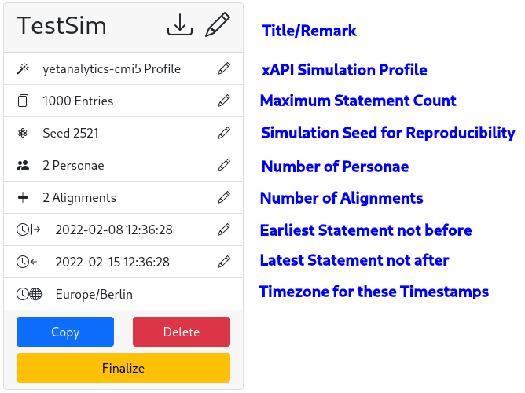
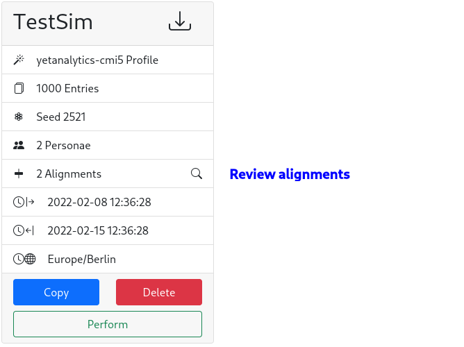
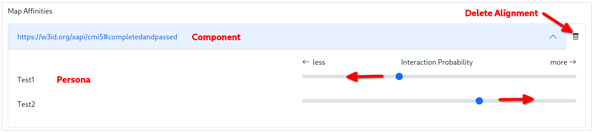

# User's Guide

| Project Title          | Version |    Date    | Author                          |
|:-----------------------|:-------:|:----------:|:--------------------------------|
| xAPI Toolkit - DATASIM |   v1    | 08.02.2022 | Konstantin Köhring (@Galaxy102) |
| xAPI Toolkit - DAVE    |   v2    | 04.03.2022 | Ylvi Bachmann (@ylvion)         |

## Intro

Hello there, thank you for your interest in using the xAPI Toolkit, 
which has been begun as a Bachelor Thesis project for the research group "VerDatAs"
at the Technical University of Dresden.

To make your work as comfortable as possible, please use this manual as a reference guide when you don't find the application to be intuitive enough.

## Application Overview

The Application UI consists of the sidebar and the content.


In the Sidebar, there are three sections (from top to bottom):
1. Flows  
   They represent means to handle xAPI Statements.
2. Settings  
   There you can manipulate e.g. connection parameters.
3. Status indicators  
   At a quick glance, you can see which system components are healthy and which ones may need attention.  
   A green indicator means that everything should be alright.  
   Red indicates a remote server failure or a configuration mistake.  
   Yellow means that there was an application error which can perhaps be fixed by reloading the application by hitting Refresh or `F5`.

You can access all Settings and Flows at any time by clicking the corresponding sidebar item.


## Step-by-Step Guides: Flows

### Perform Statement Simulations using DATASIM
For all guides below, please select the appropriate flow by clicking `Simulations` in the sidebar.

Anatomy of the Simulation UI and nice to know:
* Prepared Simulations  
  These simulations' parameters can be edited by clicking the pencils on the corresponding items.

    
  By clicking `Finalize`, the simulation becomes immutable.  
  To download the simulation description file (in DATASIM format), click the download icon near the title.
* Finalized Simulations  
  These simulations have been made immutable. To adapt a simulation, click `Copy` to create a decoupled version.
  
  

#### Parametrize a DATASIM simulation
1. Click the `Create new Simulation` card.
2. Set a Simulation Title.  
   It will be used for displaying the simulation and for naming the output files.
3. Set a Simulation Profile.  
   The profiles shipped with the application have been written by Yet Analytics, the developers of DATASIM.  
   They each represent a schema after which statements will be generated.
4. Create and select Personae.  
   A persona has a name and an email address (used as unique identifier). To add a persona, insert those details into the `Add new Persona` form. If you're to lazy to imagine an email address, hit the "refresh"-ish button on the right-hand side of the input field. Press `+` to add the persona to the simulation.  
   Personae used in the simulation can be selected in the bottom form. Multiple Personae can be selected by holding down `Shift` or `Ctrl` as usual.
5. Create alignments.  
   Alignments can be used to control the affinity of personae to a specific simulation element. For now, DATASIM does not allow aligning to xAPI Verbs.  
   First, add all components you want to align to by selecting their type and identifiers from the dropdown menus in the `Add new Component` form and hitting the `+` button.  
   Afterwards, you can insert the affinities by expanding the component (&or; button) and moving the sliders around as you wish.  
   
6. Update the default simulation parameters.  
   Adapt them as you wish.  
   Number of statements is a maximum value. The seed is used to guarantee reproducibility. Simulation Start and End are the earliest and latest possible timestamp for generated xAPI Statements.

#### Editing a DATASIM simulation parametrization
1. On the card with the **non-finalized** simulation you want to edit, click the pencil icon on the part you want to change.
2. Proceed with the corresponding step of the section "Parametrize a DATASIM simulation".

#### Making a simulation description read-only
1. On the card with the simulation you want to finalize, click the `Finalize` button.

#### Creating a copy of a simulation description
1. On the card with the simulation you want to copy, click the `Copy` button.  
   This will create a decoupled and non-finalized version of the simulation.

#### Performing a DATASIM simulation
1. Perform the steps in "Parametrize a DATASIM simulation" and "Making a simulation description read-only".
2. Click `Perform` on the card with the simulation you want to send to DATASIM.

#### Exporting DATASIM simulation results
1. After "Performing a DATASIM simulation", 
2. You have to options to handle the result:
   1. You can retrieve the simulation result as JSON document by clicking `Retrieve` on the card of the simulation you want to get the result of.
   2. You can also send the result directly to an LRS by clicking `Push` and then selecting the destination LRS.

#### Deleting a simulation description
1. On the card with the simulation you want to delete, click the `Delete` button.  
   This action can not be undone.

### Import and Export LRS Data
For all guides below, please select the appropriate flow by clicking `Statement Exchange` in the sidebar.

#### Importing xAPI Statements
1. Select the LRS you want to send the statements to from the Dropdown in the `Import from JSON` card.  
   It must be enabled.
2. Select one or more file(s) of xAPI Statements using the `Choose Files` form.
3. Hit the `Send` button.  
   If the file was valid, you will receive a success message. Otherwise, an error will be displayed stating the issue with the upload.

#### Exporting xAPI Statements
1. Select the LRS you want to send the statements to from the Dropdown in the `Export to JSON` card.  
   It must be enabled.
2. Initiate the download by clicking `Retrieve`.  
   The process may take a few seconds depending on the amount of saved statements in the selected LRS.

### Perform analysis and create dashboards on xAPI Statements
For all guides below, please select the appropriate flow by clicking `Dashboards` in the sidebar.

This feature allows you to analyse xAPI Data with the help of DAVE.
It is a framework which also had been developed by Yet Analytics like DATASIM.

Nice to know:
* Predefined Analysis set  
  During the configuration of a dashboard to show your visualisations you can choose Analysis from a predefined set.
  For more information which analysis are available please read section "Managing Analysis".
* Finalized Dashboards  
  When the configuration of a dashboard is completed it is marked as finalized.
  This happens if the dashboards has a connected LRS as data source and contains at least one analysis.
  Finalized dashboards can still be edited e.g. to add new Analysis. Unfinalized dashboards can't be performed.
* Use of Selenium  
  The application uses the browser automatisation tool Selenium to access the functionality of DAVE because it has been developed as a one-page web application with no REST API.
  For each active LRS connection a connector which accesses DAVE with the help of Selenium is created automatically.
  These connectors are named after the corresponding LRS connection with the prefix 'DAVE-' and their status indicators can also be found in the third section of the sidebar.  
  Note that there is an **additional** DAVE connector which matches no LRS connection. This connector is used for the validation of analysis descriptions. For more information see section "Managing Analysis".

#### Configure a Dashboard
1. Click the `Create new Dashboard` card.
2. Set a Dashboard Title.  
   It will be used for displaying the dashboard.
3. Select an LRS as data source.  
   Note that the LRS connection has to be configured first if you want to use a new LRS.
   In order to proceed the status indicators of the selected LRS and the corresponding DAVE connector have to show no errors.
   If an LRS connection is added, reactivated or the application has just been started the DAVE connector can not be used until all xAPI Statements had been read from the corresponding LRS. The waiting state is indicated by the yellow status indicator. Depending on the amount of data that should be read this step will take a few minutes.
   When the DAVE connector is ready the status indicator turns green.
4. Select and add Analysis.  
   First select all Analysis you want to use from the defined Analysis set by selecting them in the `Add analysis` form and hitting the `+` button. You can limit their performance to a specific activity by selecting its identifier from the dropdown menu. Note that not every analysis can be limited in their execution. Please refer to the section "Managing Analysis" for further information. By default, the selected analysis is performed using the whole data set specified.  
   Afterwards, you can change the order of the analysis which have been added to the dashboard by clicking the `Arrow up` or `Arrow down` icons in the `Selected analysis` form. You can also delete an analysis from the dashboard by clicking the `Trash can` icon.  
   To improve performance the specified LRS' activities are requested once and cached. After 10 minutes the cache is cleared and the activities are requested again, if needed. If you don't want to use the cache and request them again click the `Refresh` icon in the `Add analysis` form.

#### Editing a Dashboard configuration
1. On the card with the dashboard you want to edit, click the pencil icon on the part you want to change.
2. Proceed with the corresponding step of the section "Configure a Dashboard".

#### Creating a copy of a Dashboard description
1. On the card with the dashboard you want to copy, click the `Copy` button.
   This will create a decoupled version of the dashboard description. If the original dashboard description was marked as finalized the copy will be too.  

#### Deleting a Dashboard description
1. On the card with the dashboard you want to delete, click the `Delete` button.   
   This action can not be undone.

#### Perform analysis of a Dashboard
1. Perform the steps in "Configure a Dashboard".
2. Click `Perform` on the card with the dashboard you want to execute its analysis and get its graphics with the help of DAVE.  
   The graphics will be updated every five minutes.
   **Important:** There is no way to distinguish if an empty graphic is the result of a wrongly described analysis (e.g. Query parameter naming does not match the Graph Description naming), the misuse of a predefined analysis on the data set or the source data set is not containing the queried data. Please refer to section "Managing Analysis" for further information.

#### Exporting visualisations
1. After executing the step "Perform analysis of a Dashboard" you can download the graphics you want to by clicking the `Download` icon beside their name.  
   The graphic is saved in the SVG data format and named following this scheme: 'vis-' + 'name of dashboard-' + 'name of analysis-' + 'timestamp'. This should allow you to easily distinguish different graphics.  
   Please note that, when an analysis was limited on a special activity, this information is **not** represented in the name of the corresponding graphic file.

## Step-by-Step Guides: Settings

### Managing LRS Connections
For all guides below, please access the appropriate setting by clicking `LRS Connections` in the sidebar.

#### Adding a connection
1. Click the Card `Create new Connection`.
2. Enter the Details of the LRS.  
   They are usually shown to you by your Learning Record Store.  
   The Name field will be used for the status indicator and to reference the LRS in flows.
3. Click `Save`.
4. To display the status indicator in the sidebar, reload the Application by hitting Refresh or `F5`.

#### Editing a connection
1. On the card of the LRS connection you want to edit, press the `Edit` button.
2. Update the Details of the LRS.
3. Click `Save`.
4. To update the status indicator in the sidebar, reload the Application by hitting Refresh or `F5`.  
   The indicator may be flaky or yellow at first, but becomes stable after at most 2 minutes.

#### Deactivating a connection
1. On the card of the LRS connection you want to disable, press the `Deactivate` button.
2. To remove the status indicator from the sidebar, reload the Application by hitting Refresh or `F5`.  
   Otherwise, the indicator will turn yellow after some time.

#### Reactivating a connection
1. Click `Also show inactive Connections` on the first card.
2. On the card of the LRS connection you want to re-enable, press the `Reactivate` button.
3. To display the status indicator in the sidebar, reload the Application by hitting Refresh or `F5`.

### Managing Analysis
For all guides below, please access the appropriate setting by clicking `DAVE Analysis` in the sidebar.

Nice to know:
* Finalized Analysis
  When the configuration of an analysis is completed it is marked as finalized.
  This happens if the analysis has a valid query and graph description.
  Finalized analysis can still be edited. Only finalized analysis can be added to a dashboard and performed.
* Validation of analysis
  When an analysis should be created or edited its query and graph description are checked with the help of DAVE.  
  Please note that this validation can **only** check if the descriptions contain **syntax errors** and not if performing them won't lead to an empty visualisation (e.g. caused by inconsistent naming of variables).  
  In chase of a syntax error the error message of the DAVE framework will be shown. Unfortunately sometimes the provided error messages aren't formulated in a way that will help you to easily understand them and resolve the error. Therefore, the realization of an editor which supports the creation and editing of analysis would be a useful and important enhancement of this application.
* Empty visualisations
  As stated earlier, unfortunately it's not possible to perform an automated check to reveal the reason for an empty visualisation.
  If you experience this error the reason can be one of the following:
  1. You tried to apply an analysis from the predefined analysis set onto an unsupported source data set.  
     Please refer to section "Predefined Analysis" to get information which xAPI Profiles are supported, explanations on the single analysis and their usage.
  2. The analysis description has the correct syntax but contains errors like the use of inconsistent naming of variables in the query and graph description or the usage of wrong variables to apply in the graph description.  
     Please refer to section "DAVE Analysis" to get further information on the syntax of query and graph descriptions and some examples.
  3. The specified source data set does not contain the requested data. In this case the analysis result is empty by correct.
  
#### Adding an Analysis
1. You have two options when adding an Analysis:
    1. You can import an analysis description saved as JSON. For more information see section "Import of Analysis".
    2. You can create a new analysis description by clicking `Create new analysis`.
2. Set an Analysis name.  
   It will be used for displaying the dashboard and for naming the output file. 
3. Configure the Query.  
   You have two options for doing this:
   1. Select a query from the dropdown menu.    
      The corresponding description is shown.  
      If you want to, you can adapt it as you like. Please refer to section "DAVE Analysis" for information on the syntax and examples.  
      If the query is used in another analysis you will be prompted a hint. Please note that, by giving your consent you allow that your changes are applied to **all** affected analysis and dashboards which use them.
   2. Write a new Query.  
      Choose a suitable name for the Query and write its description following the rules provided in section "DAVE Analysis".
4. Configure the Graph Description.  
   You have two options for doing this:
    1. Select a graph description from the dropdown menu.    
       The corresponding description is shown.  
       If you want to, you can adapt it as you like. Please refer to section "DAVE Analysis" for information on the syntax and examples.
       If the graph description is used in another analysis you will be prompted a hint. Please note that, by giving your consent you allow that your changes are applied to **all** affected analysis and dashboards which use them.
    2. Write a new Graph Description.  
       Choose a suitable name for the Graph Description and write its description following the rules provided in section "DAVE Analysis".

#### Editing an Analysis description
1. On the card with the analysis you want to edit, click the `Edit` button.
2. Proceed with the corresponding step of the section "Adding an Analysis".
   If the analysis or some part of it is used in another analysis description or a dashboard you will be prompted a hint. Please note that, by giving your consent you allow that your changes are applied to **all** affected analysis or dashboards.

#### Creating a copy of an Analysis
1. On the card with the analysis you want to copy, click the `Copy` button.
   This will create a decoupled version of the analysis description. If the original analysis description was marked as finalized the copy will be too.

#### Deleting an Analysis
1. On the card with the analysis you want to delete, click the `Delete` button.   
   If the analysis is used in a dashboard it can't be deleted, and you will be prompted a hint.
   This action can not be undone.

#### Import of Analysis
1. Select one or more file(s) of analysis descriptions using the `Select Files` form in the `Import from JSON` card.
2. Click the `Add` button. 
   If the file was valid, the analysis will be added and shown on the overview page. Otherwise, an error will be displayed stating the issue with the upload.

#### Export of Analysis
1. On the card with the analysis which description you want to download click the `Download` icon beside their name.
   The description is saved in the JSON format and is named after the name of the corresponding Analysis.

#### Predefined Analysis
This section contains an explanation for each analysis from the predefined analysis set and if their performance can be limited to a single Activity of an LRS as data source.

Nice to know:
1. Supported data
   The performing of analysis can be executed on xAPI Statements which comply with the cmi5 xAPI Profile and are stored in an LRS. This could either be real-life data of learners (in the context of the VerDatAs project) or data simulated with the help of Datasim.  
   This limitation is conditioned by the available Query Parameters in the DAVE framework. Please refer to section "DAVE Analysis" to get further information.
2. Different analysis for simulated or real-life data
   At this moment there are some differences between these types of data sets.
   1. Simulations which are created using Datasim do **not** contain information on the amount of points that a learner scored while solving an Activity. Therefore, performing an analysis which will examine these points will always provide an empty visualization.  
      Every predefined analysis using the scored points specifies this in its name. To highlight this further they are also marked with the label \[VerDatAs\].
      As soon as Datasim simulations will be able to simulate the amount of scored points this limitation will become invalid.
   2. At this moment the provided real-life data sets of the VerDatAs project allows the grouping of data from different accounts of a user if they belong to the same user agent. Therefore, the grouping by the user agent's name will lead to the loss of information to distinguish the different accounts.  
      To examine and preserve this data, special analysis descriptions which use the name corresponding to the provided user agents' **accounts** should be used. To highlight these analysis they are marked with the label \[VerDatAs].
      If you are not interested in illustrating this data you can examine the data by using the analysis which don't have the label \[VerDatAs\]. **Exclusion:** The decision made in 1. is not changed by this.

##### Learners' activity
To illustrate the activity of learners, this analysis counts the amount of xAPI Statements provided by each learner in the source data set and groups them accordingly, while distinguishing the learners by the agents they used.  
To visualize this analysis the Top 10 most active learners' data is arranged in a bar chart. The y-axis shows the number of xAPI Statements and the x-axis shows the names belonging to the selected user agents.  
If you want to visualize the Top 10 least active learners, edit the analysis description as explained in "Editing an Analysis description". **Hint:** You have to select the graph description, which is named 'Top 10 statements ASC'. Section "DAVE Analysis" explains why.  
This analysis can be limited to a special Activity of an LRS and will then illustrate the most active learners in this Activity.  
This analysis can be applied to simulated or real-life data (if you're not interested in illustrating data from different accounts of a learner). Please refer to the 'Nice to know' of this section to get more information.

##### Learners' activity \[VerDatAs\]
To illustrate the activity of learners, this analysis counts the amount of xAPI Statements provided by each learner in the source data set and groups them accordingly, while distinguishing the learners by the accounts provided by the user agents they used.  
To visualize this analysis the Top 10 most active learners' data is arranged in a bar chart. The y-axis shows the number of xAPI Statements and the x-axis shows the names belonging to the different accounts of the user agents.  
If you want to visualize the Top 10 least active learners, edit the analysis description as explained in "Editing an Analysis description". **Hint:** You have to select the graph description, which is named 'Top 10 statements ASC'. Section "DAVE Analysis" explains why.  
This analysis can be limited to a special Activity of an LRS and will then illustrate the most active learners in this Activity.  
Please note that, this analysis should be applied to study a set of data from the VerDatAs project if you want to illustrate the data belonging to a single user agent divided by the corresponding user accounts. Please refer to the 'Nice to know' of this section to get more information.

##### Learners' activity per Activity
To illustrate the activity of learners in relation to the different Activities saved in the source LRS, this analysis counts the amount of xAPI Statements belonging to one Activity and groups it accordingly, while distinguishing the Activities by their identification.  
To visualize this analysis the Top 10 Activities which were most interacted with by the learners are arranged in a bar chart. The y-axis shows the number of xAPI Statements and the x-axis shows the Activities' identification.  
If you want to visualize the Top 10 Activities least interacted with, edit the analysis description as explained in "Editing an Analysis description". **Hint:** You have to select the graph description, which is named 'Top 10 statements ASC'. Section "DAVE Analysis" explains why.  
This analysis can be limited to a special Activity of an LRS and will then illustrate the number of interactions for this Activity.  
It can be applied to simulated or real-life data sets.

##### Learners per Activity
To illustrate the number of learners in relation to the different Activities of the source LRS, this analysis counts how many learners have interacted with a special Activity by using the learners' user agents and groups this data accordingly to the different Activities by using their identification.    
To visualize this analysis the Top 10 Activities which have the highest number of active learners are arranged in a bar chart. The y-axis shows the number of learners and the x-axis shows the Activities' identification.  
If you want to visualize the Top 10 Activities with the lowest number of learners, edit the analysis description as explained in "Editing an Analysis description". **Hint:** You have to select the graph description, which is named 'Top 10 distinct ASC'. Section "DAVE Analysis" explains why.  
This analysis can be limited to a special Activity of an LRS and will then illustrate the number of learners for this Activity.  
It can be applied to simulated or real-life data sets (if you're not interested in illustrating data from different accounts of a learner). Please refer to the 'Nice to know' of this section to get more information.

##### Learners per Activity \[VerDatAs\]
To illustrate the number of learners in relation to the different Activities of the source LRS, this analysis counts how many learners have interacted with a special Activity by using the learners' user accounts belonging to the user agents and groups this data accordingly to the different Activities by using their identification.    
To visualize this analysis the Top 10 Activities which have the highest number of active learners are arranged in a bar chart. The y-axis shows the number of learners and the x-axis shows the Activities' identification.  
If you want to visualize the Top 10 Activities with the lowest number of learners, edit the analysis description as explained in "Editing an Analysis description". **Hint:** You have to select the graph description, which is named 'Top 10 distinct ASC'. Section "DAVE Analysis" explains why.  
This analysis can be limited to a special Activity of an LRS and will then illustrate the number of learners for this Activity.  
It can be applied to real-life data sets if you're interested in illustrating data from different accounts of a learner. Please refer to the 'Nice to know' of this section to get more information.

##### Learners' task determination
To illustrate the amount of Activities a learner could not pass with the first try, this analysis scans for xAPI Statements which indicate both unsuccessful and successful completions of an Activity and distinguishes them by the user agent they belong to. After this the found xAPI Statements are filtered using their timestamp to find all successful completions of an Activity for which at least one unsuccessful try was made in the past. The resulting data is grouped by the user agent it belongs to and the amount of Activities needing multiple tries are counted.  
To visualize this analysis the Top 10 learners having trouble with multiple Activities are arranged in a bar chart. The y-axis shows the number of Activities that weren't completed in the first try and the x-axis shows the names belonging to the selected user agents.  
If you want to visualize the Top 10 Activities with the lowest number of Activities satisfying the condition, edit the analysis description as explained in "Editing an Analysis description". **Hint:** You have to select the graph description, which is named 'Top 10 distinct ASC'. Section "DAVE Analysis" explains why.
This analysis can **not** be limited to a special Activity.  
It can be applied to simulated or real-life data sets (if you're not interested in illustrating data from different accounts of a learner). Please refer to the 'Nice to know' of this section to get more information.

##### Learners' task determination \[VerDatAs\]
To illustrate the amount of Activities a learner could not pass with the first try, this analysis scans for xAPI Statements which indicate both unsuccessful and successful completions of an Activity and distinguishes them by the user accounts they belong to. After this the found xAPI Statements are filtered using their timestamp to find all successful completions of an Activity for which at least one unsuccessful try was made in the past. The resulting data is grouped by the user accounts it belongs to and the amount of Activities needing multiple tries are counted.  
To visualize this analysis the Top 10 learners having trouble with multiple Activities are arranged in a bar chart. The y-axis shows the number of Activities that weren't completed in the first try and the x-axis shows the names belonging to the selected user accounts.  
If you want to visualize the Top 10 learners with the lowest number of Activities satisfying the condition, edit the analysis description as explained in "Editing an Analysis description". **Hint:** You have to select the graph description, which is named 'Top 10 distinct ASC'. Section "DAVE Analysis" explains why.
This analysis can **not** be limited to a special Activity.  
It can be applied to real-life data sets if you're interested in illustrating data from different accounts of a learner. Please refer to the 'Nice to know' of this section to get more information.

##### Learners' unlearning
To illustrate the amount of Activities a learner has passed and later failed, this analysis scans for xAPI Statements which indicate both unsuccessful and successful completions of an Activity and distinguishes them by the user agent they belong to. After this the found xAPI Statements are filtered using their timestamp to find all unsuccessful completions of an Activity for which a successful try was made in the past. The resulting data is grouped by the user agent it belongs to and the amount of Activities which satisfy the condition are counted.  
To visualize this analysis the Top 10 learners having trouble with multiple Activities are arranged in a bar chart. The y-axis shows the number of Activities that were completed and afterwarts failed and the x-axis shows the names belonging to the selected user agents.  
If you want to visualize the Top 10 Activities with the lowest number of Activities satisfying the condition, edit the analysis description as explained in "Editing an Analysis description". **Hint:** You have to select the graph description, which is named 'Top 10 distinct ASC'. Section "DAVE Analysis" explains why.
This analysis can **not** be limited to a special Activity.  
It can be applied to simulated or real-life data sets (if you're not interested in illustrating data from different accounts of a learner). Please refer to the 'Nice to know' of this section to get more information.

##### Learners' unlearning \[VerDatAs\]
To illustrate the amount of Activities a learner has passed and later failed, this analysis scans for xAPI Statements which indicate both unsuccessful and successful completions of an Activity and distinguishes them by the user accounts they belong to. After this the found xAPI Statements are filtered using their timestamp to find all unsuccessful completions of an Activity for which a successful try was made in the past. The resulting data is grouped by the user accounts it belongs to and the amount of Activities which satisfy the condition are counted.  
To visualize this analysis the Top 10 learners having trouble with multiple Activities are arranged in a bar chart. The y-axis shows the number of Activities that were completed and afterwarts failed and the x-axis shows the names belonging to the selected user accounts.  
If you want to visualize the Top 10 Activities with the lowest number of Activities satisfying the condition, edit the analysis description as explained in "Editing an Analysis description". **Hint:** You have to select the graph description, which is named 'Top 10 distinct ASC'. Section "DAVE Analysis" explains why.
This analysis can **not** be limited to a special Activity.  
It can be applied to real-life data sets if you're interested in illustrating data from different accounts of a learner. Please refer to the 'Nice to know' of this section to get more information.

##### Successful execution per Activity
To illustrate the difficulty of an Activity by the number of successful completions, this analysis scans for xAPI Statements which indicate a successful completion and groups them by the Activity they belong to using the Activity's identifier.  
To visualize this analysis the Top 10 Activities with the highest number of successful completions are arranged in a bar chart. The y-axis shows the number of successful completions and the x-axis shows the Activities' identification.  
If you want to visualize the Top 10 Activities with the lowest number of successful completions, edit the analysis description as explained in "Editing an Analysis description". **Hint:** You have to select the graph description, which is named 'Top 10 value DESC'. Section "DAVE Analysis" explains why.
This analysis can be limited to a special Activity of an LRS and will then illustrate the number of successful completions for this Activity.
It can be applied to simulated or real-life data sets.

##### Unsuccessful execution per Activity
To illustrate the difficulty of an Activity by the number of unsuccessful completions, this analysis scans for xAPI Statements which indicate an unsuccessful completion and groups them by the Activity they belong to using the Activity's identifier.  
To visualize this analysis the Top 10 Activities with the highest number of unsuccessful completions are arranged in a bar chart. The y-axis shows the number of unsuccessful completions and the x-axis shows the Activities' identification.  
If you want to visualize the Top 10 Activities with the lowest number of unsuccessful completions, edit the analysis description as explained in "Editing an Analysis description". **Hint:** You have to select the graph description, which is named 'Top 10 value DESC'. Section "DAVE Analysis" explains why.
This analysis can be limited to a special Activity of an LRS and will then illustrate the number of unsuccessful completions for this Activity.
It can be applied to simulated or real-life data sets.

##### Successful learners per Activity
To illustrate the difficulty of an Activity by the number of successful learners, this analysis counts how many learners have successfully completed a special Activity by using the learners' user agents and groups this data accordingly to the different Activities by using their identification.    
To visualize this analysis the Top 10 Activities which have the highest number of successful learners are arranged in a bar chart. The y-axis shows the number of successful learners and the x-axis shows the Activities' identification.  
If you want to visualize the Top 10 Activities with the lowest number of successful learners, edit the analysis description as explained in "Editing an Analysis description". **Hint:** You have to select the graph description, which is named 'Top 10 distinct ASC'. Section "DAVE Analysis" explains why.  
This analysis can be limited to a special Activity of an LRS and will then illustrate the number of successful learners for this Activity.  
It can be applied to simulated or real-life data sets (if you're not interested in illustrating data from different accounts of a learner). Please refer to the 'Nice to know' of this section to get more information.

##### Successful learners per Activity \[VerDatAs\]
To illustrate the difficulty of an Activity by the number of successful learners, this analysis counts how many learners have successfully completed a special Activity by using the learners' user accounts belonging to the user agents and groups this data accordingly to the different Activities by using their identification.    
To visualize this analysis the Top 10 Activities which have the highest number of successful learners are arranged in a bar chart. The y-axis shows the number of successful learners and the x-axis shows the Activities' identification.  
If you want to visualize the Top 10 Activities with the lowest number of successful learners, edit the analysis description as explained in "Editing an Analysis description". **Hint:** You have to select the graph description, which is named 'Top 10 distinct ASC'. Section "DAVE Analysis" explains why.  
This analysis can be limited to a special Activity of an LRS and will then illustrate the number of successful learners for this Activity.  
It can be applied to real-life data sets if you're interested in illustrating data from different accounts of a learner. Please refer to the 'Nice to know' of this section to get more information.

##### Unsuccessful learners per Activity
To illustrate the difficulty of an Activity by the number of unsuccessful learners, this analysis counts how many learners have unsuccessfully completed a special Activity by using the learners' user agents and groups this data accordingly to the different Activities by using their identification.    
To visualize this analysis the Top 10 Activities which have the highest number of unsuccessful learners are arranged in a bar chart. The y-axis shows the number of unsuccessful learners and the x-axis shows the Activities' identification.  
If you want to visualize the Top 10 Activities with the lowest number of unsuccessful learners, edit the analysis description as explained in "Editing an Analysis description". **Hint:** You have to select the graph description, which is named 'Top 10 distinct ASC'. Section "DAVE Analysis" explains why.  
This analysis can be limited to a special Activity of an LRS and will then illustrate the number of unsuccessful learners for this Activity.  
It can be applied to simulated or real-life data sets (if you're not interested in illustrating data from different accounts of a learner). Please refer to the 'Nice to know' of this section to get more information.

##### Unsuccessful learners per Activity \[VerDatAs\]
To illustrate the difficulty of an Activity by the number of unsuccessful learners, this analysis counts how many learners have unsuccessfully completed a special Activity by using the learners' user accounts belonging to the user agents and groups this data accordingly to the different Activities by using their identification.    
To visualize this analysis the Top 10 Activities which have the highest number of unsuccessful learners are arranged in a bar chart. The y-axis shows the number of unsuccessful learners and the x-axis shows the Activities' identification.  
If you want to visualize the Top 10 Activities with the lowest number of unsuccessful learners, edit the analysis description as explained in "Editing an Analysis description". **Hint:** You have to select the graph description, which is named 'Top 10 distinct ASC'. Section "DAVE Analysis" explains why.  
This analysis can be limited to a special Activity of an LRS and will then illustrate the number of unsuccessful learners for this Activity.  
It can be applied to real-life data sets if you're interested in illustrating data from different accounts of a learner. Please refer to the 'Nice to know' of this section to get more information.

##### Learners' scaled scores over time \[VerDatAs\]
To illustrate the learners progress, this analysis visualizes the points a learner has scored over time by collecting them, scaling them on an axis from 0 to 1 (seen as points scored from amount of possible points in percent) and grouping the data by the user agent it belongs to.  
To visualize this analysis a scatter plot is used. The y-axis shows the scaled score that was reached and the x-axis shows a timeline. The use of different colors and a legend to match them to the different learners makes the diagram more readable.  
This analysis can be limited to a special Activity of an LRS and will then illustrate the scaled score the learners have scored over time for this Activity.  
It can **only** be applied to real-life data sets and will use the unification of user accounts. Therefore, it is possible to examine the progress of a single learner more easily.

##### Learners' success over time \[Datasim\]
To illustrate the learners progress, this analysis visualizes the success of a learner over time adapted on simulated data. As it has been explained in the 'Nice to know' of this section, Datasim can not simulate Activities with points that can be scored. Therefore, this analysis collects all xAPI Statements which indicate the completion of an Activity, scaling them on an axis from 0 to 1 (seen as 0 equals unsuccessful completion) and groups the data by the user agent it belongs to.  
To visualize this analysis a scatter plot is used. The y-axis shows the scaled score that was reached and the x-axis shows a timeline. The use of different colors and a legend to match them to the different learners makes the diagram more readable.  
This analysis can be limited to a special Activity of an LRS and will then illustrate the scaled score the learners have scored over time for this Activity.  
It should **only** be applied to simulated data because otherwise useful information on the point a learner scored will not be examined.

##### Learners' raw score per Activity \[VerDatAs\]
To illustrate the learners raw results for the completion of an Activity, this analysis visualizes the raw points a learner has scored for a special Activity by collecting them and grouping the data by the user agent it belongs to.  
To visualize this analysis the Top 10 Activities which have the highest raw score are arranged in a bar chart. The y-axis shows the raw score that was reached and the x-axis shows the Activities' identification.  
If you want to visualize the Top 10 Activities with the lowest number of unsuccessful learners, edit the analysis description as explained in "Editing an Analysis description". **Hint:** You have to select the graph description, which is named 'Top 10 value ASC'. Section "DAVE Analysis" explains why.  
This analysis can be limited to a special Activity of an LRS and will then illustrate the scaled score the learners have scored over time for this Activity.  
It can **only** be applied to real-life data sets and will use the unification of user accounts. Therefore, it is possible to examine the results of a single learner more easily.

##### Learners' average scaled score \[VerDatAs\]
To illustrate the learners average score, this analysis visualizes the average of points a learner has scored for all Activities by collecting them, scaling them on an axis from 0 to 1 (seen as points scored from amount of possible points in percent), calculating the average scored points in relation to all Activities and grouping the data by the user agent it belongs to.
To visualize this analysis the Top 10 Activities which have the highest average scaled score are arranged in a bar chart. The y-axis shows the scaled score that was reached and the x-axis shows the names belonging to the selected user agents.  
If you want to visualize the Top 10 Activities with the lowest average scaled score, edit the analysis description as explained in "Editing an Analysis description". **Hint:** You have to select the graph description, which is named 'Top 10 average value ASC'. Section "DAVE Analysis" explains why.  
This analysis can **not** be limited to a special Activity of an LRS.  
It can **only** be applied to real-life data sets and will use the unification of user accounts. Therefore, it is possible to examine the results of a single learner more easily.

##### Linear regression of learners' scaled scores by hour of day \[VerDatAs\]
To illustrate the learners progress during the day, this analysis visualizes the points a learner has scored during the day by collecting them, scaling them on an axis from 0 to 1 (seen as points scored from amount of possible points in percent) and grouping the data by the user agent it belongs to.  
To visualize this analysis a scatter plot is used. The y-axis shows the scaled score that was reached and the x-axis shows a timeline with the hours of a day. The use of different colors and a legend to match them to the different learners makes the diagram more readable.  
This analysis can be limited to a special Activity of an LRS and will then illustrate the scaled score the learners have scored during the day for this Activity.  
It can **only** be applied to real-life data sets and will use the unification of user accounts. Therefore, it is possible to examine the progress of a single learner more easily.

#### DAVE Analysis
This section provides explanation on how to use the DAVE framework and write valid Analysis descriptions.

Nice to know:
* Query language
  The DAVE framework uses a customised query syntax to filter, aggregate, and transformation xAPI Statements. This language is based on DataScript, a variant of the language Datalog which is a declarative, deductive query system using facts and rules to query data from a database.  
  The developers of DAVE at Yet Analytics provide reference to the (non finalized) [Documentation of Datalog](https://github.com/tonsky/datascript/wiki/Getting-started) and a [Datalog Tutorial Repository](https://github.com/kristianmandrup/datascript-tutorial) for getting to work with this query language.  
  From these resources the [Datalog Tutorial](http://www.learndatalogtoday.org/) and [Documentation of Datomic](https://docs.datomic.com/on-prem/index.html) which is a popular Clojure database providing similar query structure and possibilities as Datalog, were found to be most helpful. If you use the [Documentation of Datomic] to get informed, please read this description on the [Differences of DataScript and Datomic](https://github.com/tonsky/datascript#differences-from-datomic) also.
* Graph description language
  The DAVE frameword uses the VEGA 'visualization grammar, a declarative language for creating, saving, and sharing interactive visualization designs' (source: [VEGA documentation]). You can find some examples and the detailed description of this grammar on [VEGA documentation](https://vega.github.io/vega/).
* Possible xAPI Attributes
  Yet Analytics provides a [List of xAPI Attributes](https://github.com/yetanalytics/dave/blob/master/QUERY.md) that can be queried and examined in a DAVE Query.  
  Please note that, at this moment, **only** these can be addressed in the query description of an Analysis, because they are directly programmed into the source code of DAVE.

##### Query description
This section explains the structure and possible filtering done by a DAVE query using an example from the predefined analysis set.
Example: Successful learners per activity
```
[:find (count-distinct ?ac) ?c
:where
[?s :statement/object ?o]
[?s :statement.result/success true]
[?o :activity/id ?c]
[?s :statement/actor ?l]
[?l :agent/name ?ac]]
```
The keyword `:find` in the first line specifies which data is returned by the query. In this case it's the number of available user agents distinguished by their name (`count-distinct value` and description in line 7) and the set of identifiers of the available Activities (`value` and description on line 5). These values have to be assigned to a variable, so you can apply further filters on them in the query description or return them.  
The keyword `:where` marks the start of your description which filters should be applied to the source data set.  
In line 3 and 5 the `object` part of the xAPI Statements is accessed and used to get the identifier of the related Activity.  
In line 6 and 7 the `actor` of the xAPI Statements are queried and name of the corresponding user agent is accessed.  
In line 4 the xAPI Statements are filtered according to their `result` part. Only these statements where this part contains the identification `success` which value has to be true, are kept.  
The execution of this Query will provide you the number of user agents which have successfully completed an Activity for all possible Activities and groups the result by the Activities' identifiers.  

Examples for further useful functions which can be applied to query values are: `count`, `min`, `max` and `avg`. A list of possible functions can be found at (https://docs.datomic.com/on-prem/query/query.html).  
Please note, that nesting of these functions is **not** possible. You have to use variables to bind intermediate results and use them as parameters for further functions.

This application uses a query description similar to
```
[?s :statement/object ?so]
[?so :activity/id "INSERT ACTIVITY ID" ]]
```
to limit the execution of a DAVE Query to a special Activity. Therefore, you can **not** use `so` as name for your variables to not reduce the functionality.

##### Graph description
This section explains the structure of a VEGA visualization description using an example from the predefined analysis set.
Please refer to the tutorials found at the [VEGA documentation](https://vega.github.io/vega/) to get to know the different parts possible for a graph description and their functionality.

If you want to visualize the Top 10 results of the Query 'Successful learners per activity' described in section "Query description" you can use this visualization description:
```
{
  "$schema": "https://vega.github.io/schema/vega/v5.json",
  "width": 400,
  "height": 200,
  "padding": 15,

  "data": [
    {     s
      "name": "table",
      "source": "result",
      "transform": [
        { "type": "collect", "sort": {"field": "count-distinct_?ac", "order" : "descending" }},
        {
          "type": "window",
          "sort": {"field": "count-distinct_?ac", "order": "descending"},
          "ops": ["rank"],
          "fields": [null],
          "as": ["rank"]
        },
       s
        { "type": "filter", "expr": "datum.rank < 15"}
      ]
    }
  ],

  "signals": [
    {
      "name": "tooltip",
      "value": {},
      "on": [
        {"events": "rect:mouseover", "update": "datum"},
        {"events": "rect:mouseout",  "update": "{}"}
      ]
    }
  ],

  "scales": [
    {
      "name": "xscale",
      "type": "band",
      "domain": {"data": "table", "field": "?c"},
      "range": "width",
      "padding": 0.05,
      "round": true
    },
    {
      "name": "yscale",
      "domain": {"data": "table", "field": "count-distinct_?ac"},
      "nice": true,
      "range": "height"
    }
  ],

  "axes": [
    { "orient": "bottom", "scale": "xscale", "labelAngle": -35, "zindex": 2 },
    { "orient": "left", "scale": "yscale", "tickMinStep":1 }
  ],

  "marks": [
    {
      "type": "rect",
      "from": {"data":"table"},
      "encode": {
        "enter": {
          "x": {"scale": "xscale", "field": "?c"},
          "width": {"scale": "xscale", "band": 1},
          "y": {"scale": "yscale", "field": "count-distinct_?ac"},
          "y2": {"scale": "yscale", "value": 0}
        },
        "update": {
          "fill": {"value": "steelblue"}
        },
        "hover": {
          "fill": {"value": "red"}
        }
      }
    }
  ]
}
```
Please note that the naming of your return values of your DAVE Query has to be identical to the naming of the values you access and assign in your graph description.  
Return values of a query can be referred to like this:
| Value in DAVE Query        | Value in VEGA description |  example                                  |
|   `value`                  |   `value`                 |  ?v and "?v"                              |
|   `count` `value`          |   `count`_`value`         |  count ?v and "count_?v"                  |
|   `count-distinct` `value` | `count-distinct`_`value`  | count-distinct ?v and "count-distinct_?v" |
This scheme can also be applied when using other functions on the return values of the DAVE query.