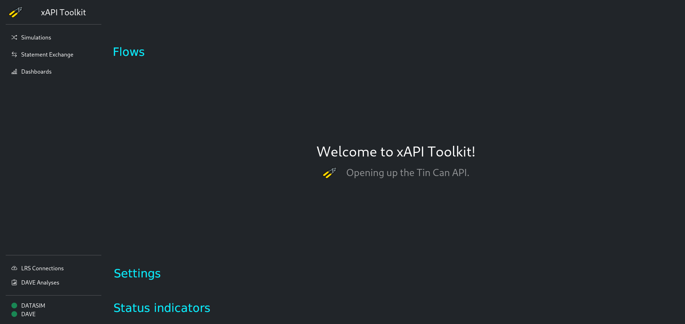

# User's Guide

| Project Title          | Version |    Date    | Author                          |
|:-----------------------|:-------:|:----------:|:--------------------------------|
| xAPI Toolkit - DATASIM |   v1    | 08.02.2022 | Konstantin Köhring (@Galaxy102) |

## Intro

Hello there, thank you for your interest in using the xAPI Toolkit, 
which has been begun as a Bachelor Thesis project for the research group "VerDatAs"
at the Technical University of Dresden.

To make your work as comfortable as possible, please use this manual as a reference guide when you don't find the application to be intuitive enough.

## Application Overview

The Application UI consists of the sidebar and the content.

In the Sidebar, there are three sections (from top to bottom):
1. Flows  
   They represent means to handle xAPI Statements.
2. Settings  
   There you can manipulate e.g. connection parameters.
3. Status indicators
   At a quick glance, you can see which system components are healthy and which ones may need attention.  
   A green indicator means that everything should be alright.  
   Red indicates a remote server failure or a configuration mistake.  
   Yellow means that there was an application error which can perhaps be fixed by reloading the application by hitting Refresh or `F5`.

You can access all Settings and Flows at any time by clicking the corresponding sidebar item.

## Step-by-Step Guides: Flows

### Perform Statement Simulation using DATASIM
For all guides below, please select the appropriate flow by clicking `Simulations` in the sidebar.

Anatomy of the Simulation UI and nice to know:
* Prepared Simulations  
  These simulations' parameters can be edited by clicking the pencils on the corresponding items.

    
  By clicking `Finalize`, the simulation becomes immutable.  
  To download the simulation description file (in DATASIM format), click the download icon near the title.
* Finalized Simulations  
  These simulations have been made immutable. To adapt a simulation, click `Copy` to create a decoupled version.
  
  

#### Parametrize a DATASIM simulation
1. Click the `Create new Simulation` card.
2. Set a Simulation Title.  
   It will be used for displaying the simulation and for naming the output files.
3. Set a Simulation Profile.  
   The profiles shipped with the application have been written by Yet Analytics, the developers of DATASIM.  
   They each represent a schema after which statements will be generated.
4. Create and select Personae.  
   A persona has a name and an email address (used as unique identifier). To add a persona, insert those details into the `Add new Persona` form. If you're to lazy to imagine an email address, hit the "refresh"-ish button on the right-hand side of the input field. Press `+` to add the persona to the simulation.  
   Personae used in the simulation can be selected in bottom form. Multiple Personae can be selected by holding down `Shift` or `Ctrl` as usual.
5. Create alignments.  
   Alignments can be used to control the affinity of personae to a specific simulation element. For now, DATASIM does not allow aligning to xAPI Verbs.  
   First, add all components you want to align to by selecting their type and identifiers from the dropdown menus in the `Add new Component` form and hitting the `+` button.  
   Afterwards, you can insert the affinities by expanding the component ($\lor$ button) and moving the sliders around as you wish.  
   
6. Update the default simulation parameters.  
   Adapt them as you wish.  
   Number of statements is a maximum value. The seed is used to guarantee reproducibility. Simulation Start and End are the earliest and latest possible timestamp for generated xAPI Statements.

#### Editing a DATASIM simulation parametrization
1. On the card with the **non-finalized** simulation you want to edit, click the pencil icon on the part you want to change.
2. Proceed with the corresponding step of the section "Parametrize a DATASIM simulation".

#### Making a simulation description read-only
1. On the card with the simulation you want to finalize, click the `Finalize` button.

#### Creating a copy of a simulation description
1. On the card with the simulation you want to copy, click the `Copy` button.  
   This will create a decoupled and non-finalized version of the simulation card.

#### Performing a DATASIM simulation
1. Perform the steps in "Parametrize a DATASIM simulation" and "Making a simulation description read-only".
2. Click `Perform` on the card with the simulation you want to send to DATASIM.

#### Exporting DATASIM simulation results
1. After "Performing a DATASIM simulation", 
2. You have to options to handle the result:
   1. You can retrieve the simulation result as JSON document by clicking `Retrieve` on the card of the simulation you want to get the result of.
   2. You can also send the result directly to an LRS by clicking `Push` and then selecting the destination LRS.

#### Deleting a simulation description
1. On the card with the simulation you want to delete, click the `Delete` button.  
   This action can not be undone.

### Import and Export LRS Data
For all guides below, please select the appropriate flow by clicking `Statement Exchange` in the sidebar.

#### Importing xAPI Statements
1. Select the LRS you want to send the statements to from the Dropdown in the `Import from JSON` card.  
   It must be enabled.
2. Select one or more file(s) of xAPI Statements using the `Choose Files` form.
3. Hit the `Send` button.  
   If the file was valid, you will receive a success message. Otherwise, an error will be displayed stating the issue with the upload.

#### Exporting xAPI Statements
1. Select the LRS you want to send the statements to from the Dropdown in the `Import from JSON` card.  
   It must be enabled.
2. Initiate the download by clicking `Retrieve`.  
   The process may take a few seconds depending on the amount of saved statements in the selected LRS.

## Step-by-Step Guides: Settings

### Managing LRS Connections
For all guides below, please access the appropriate setting by clicking `LRS Connections` in the sidebar.

#### Adding a connection
1. Click the Card `Create new Connection`.
2. Enter the Details of the LRS.  
   They are usually shown to you by your Learning Record Store.  
   The Name field will be used for the status indicator and to reference the LRS in flows.
3. Click `Save`.
4. To display the status indicator in the sidebar, reload the Application by hitting Refresh or `F5`.

#### Editing a connection
1. On the card of the LRS connection you want to edit, press the `Edit` button.
2. Update the Details of the LRS.
3. Click `Save`.
4. To update the status indicator in the sidebar, reload the Application by hitting Refresh or `F5`.  
   The indicator may be flaky or yellow at first, but becomes stable after at most 2 minutes.

#### Deactivating a connection
1. On the card of the LRS connection you want to disable, press the `Deactivate` button.
2. To remove the status indicator from the sidebar, reload the Application by hitting Refresh or `F5`.  
   Otherwise, the indicator will turn yellow after some time.

#### Reactivating a connection
1. Click `Also show inactive Connections` on the first card.
2. On the card of the LRS connection you want to re-enable, press the `Reactivate` button.
3. To display the status indicator in the sidebar, reload the Application by hitting Refresh or `F5`.